# MapReduce vs. Spark
## Hadoop MapReduce and Apache Spark are two widely recognized big data architectures.They provide a robust platform for processing large amounts of data and integrating machine learning applications. So, this repository refers the time comparison of the both architechtrues on how those react on queries.

#### For analysing we have used hive which uses hiveQL statement which runs over MapReduce and spark which uses Spark-SQL which runs over spark framework. 

## Data set:
### To compare each processes, below data set was used which is available in the kaggle. 
### https://www.kaggle.com/code/adveros/flight-delay-eda-exploratory-data-analysis/data
##### The airlines market has been faced losses due to the flight delay and there are many reasons for delaying a flight. In this Analysis, you need to analyse the various delay happens in airlines per year and run the queries as follows.  Data set has 1000 rows.

#### Below queries were exacuted in the both setups and all experiment result were listed belows.

 
###### 1. Year wise carrier delay from 2003-2010
###### 2. Year wise NAS delay from 2003-2010
###### 3. Year wise Weather delay from 2003-2010
###### 4. Year wise late aircraft delay from 2003-2010
###### 5. Year wise security delay from 2003-2010

### [Question d.] Hadoop map reduced and Apache Spark resluts for each queries:
###### 1. Year wise carrier delay from 2003-2010

|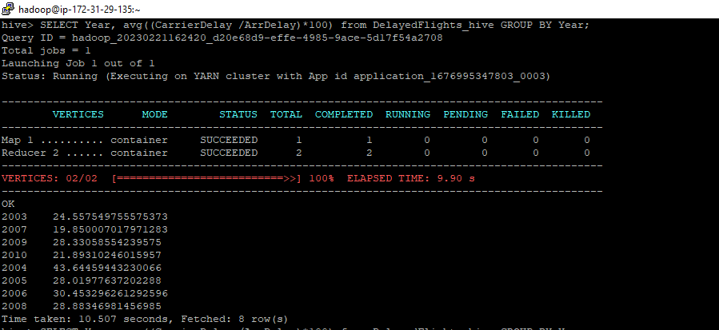  | 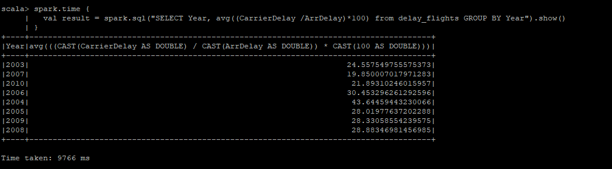|
|:---:|:---:|
| HiveQL | Spark-SQL |
###### 2. Year wise NAS delay from 2003-2010
|  | 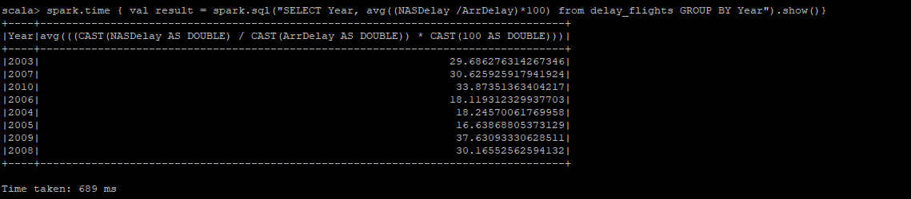|
|:---:|:---:|
| HiveQL | Spark-SQL |
###### 3. Year wise Weather delay from 2003-2010
|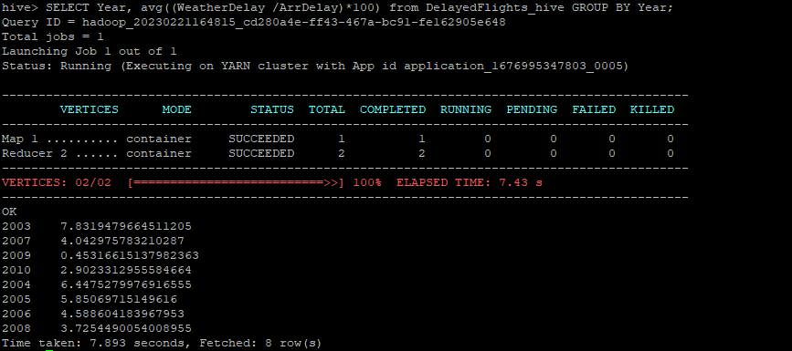  | 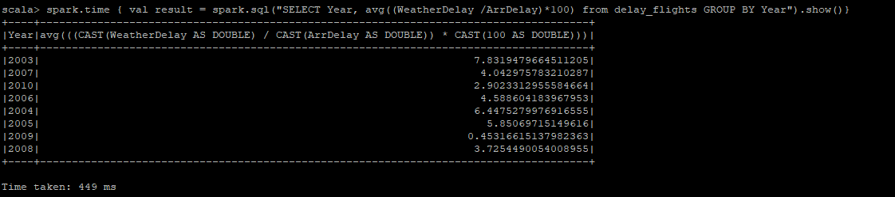 |
|:---:|:---:|
| HiveQL | Spark-SQL |
###### 4. Year wise late aircraft delay from 2003-2010
|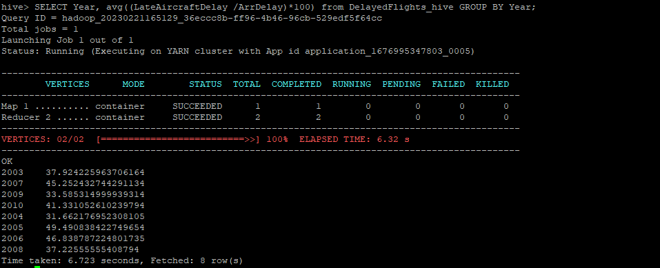  | 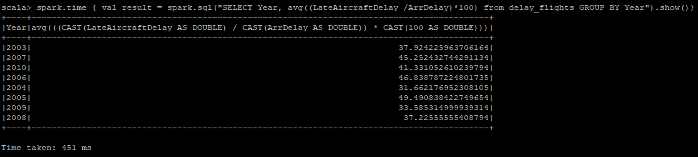|
|:---:|:---:|
| HiveQL | Spark-SQL |
###### 5. Year wise security delay from 2003-2010
|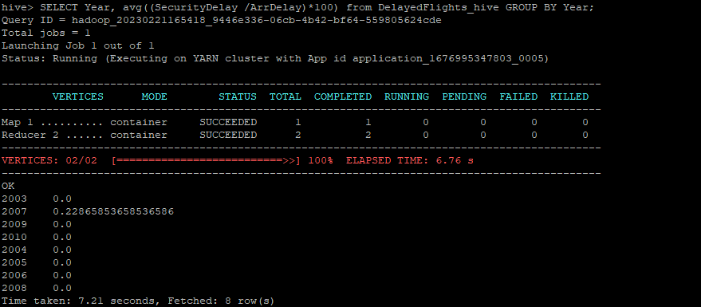  | 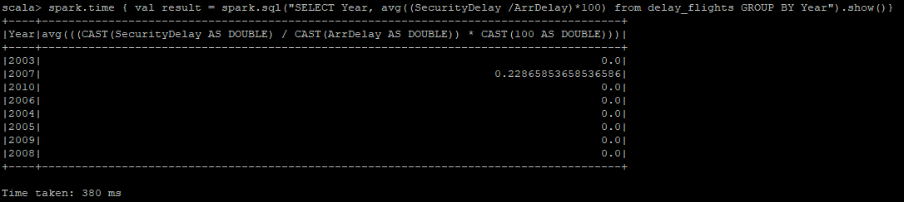|
|:---:|:---:|
| HiveQL | Spark-SQL |
### [Question e.] Hadoop and Spark comprison graph for a query.

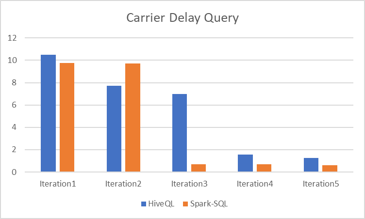

### [Question f.] Query using Hadoop and Spark for 5 times and plot the graph in comparing both methods (running time vs iteration)

#### Comparison table
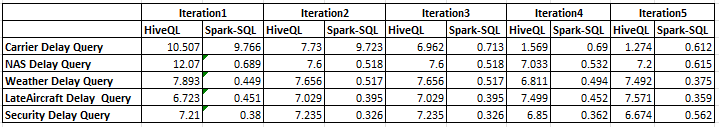

| |  |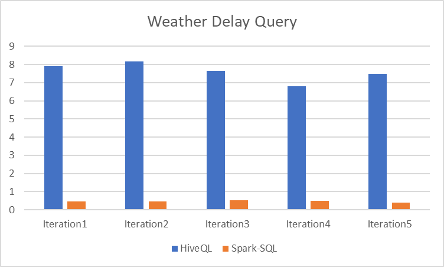 |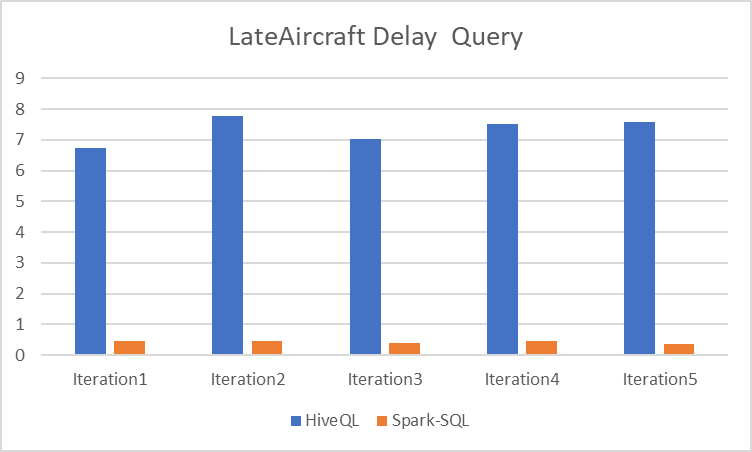 |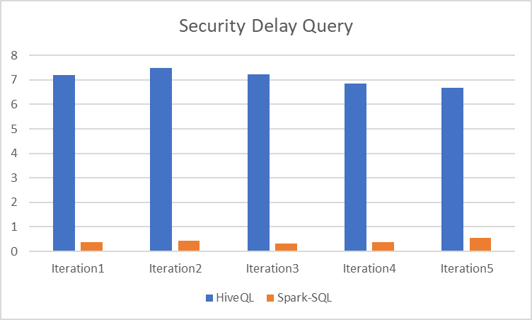 |
|:---:|:---:|:---:|:---:|:---:|
| Carrier delay | NAS delay | Weather delay | Late aircraft delay | Security delay |

### [Question g.] average time taken by MapReduce and Spark for each query
|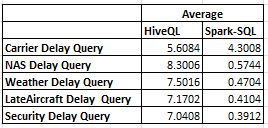|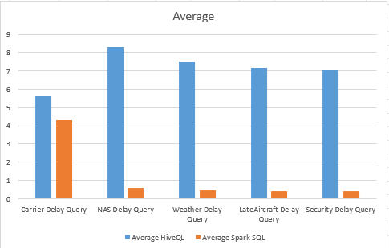|
|:---:|:---:|
| Avarage table | Avarage graph | 

## Usefull codes
### Hiveql:
#### create table and import data from csv located in s3:

```
CREATE EXTERNAL TABLE DelayedFlights_hive
(
Index int,
Year int,
Month int,
DayofMonth int,
DayOfWeek int,
DepTime int,
CRSDepTime int,
ArrTime int,
CRSArrTime int,
UniqueCarrier string,
FlightNum int,
TailNum string,
ActualElapsedTime int,
CRSElapsedTime int,
AirTime int,
ArrDelay int,
DepDelay int,
Origin string,
Dest string,
Distance int,
TaxiIn int,
TaxiOut int,
Cancelled int,
CancellationCode string,
Diverted int,
CarrierDelay int,
WeatherDelay int,
NASDelay int,
SecurityDelay int,
LateAircraftDelay int)

ROW FORMAT DELIMITED
FIELDS TERMINATED BY ','
STORED AS TEXTFILE
LOCATION 's3://mybucketsilo/emr_hive/input'
TBLPROPERTIES("skip.header.line.count"="1");

```
#### Queries:
```
SELECT Year, avg((CarrierDelay /ArrDelay)*100) from DelayedFlights_hive GROUP BY Year
SELECT Year, avg((NASDelay /ArrDelay)*100) from DelayedFlights_hive GROUP BY Year;
SELECT Year, avg((WeatherDelay /ArrDelay)*100) from DelayedFlights_hive GROUP BY Year;
SELECT Year, avg((LateAircraftDelay /ArrDelay)*100) from DelayedFlights_hive GROUP BY Year;
SELECT Year, avg((SecurityDelay /ArrDelay)*100) from DelayedFlights_hive GROUP BY Year;
```

### Spark-SQL:
#### Import data from csv located in s3:

```
val df = spark.read.format("csv").option("header", "true").option("inferSchema", "true").load("s3://aws-logs-359303467698-us-east-1/elasticmapreduce/input/DelayedFlights-updated.csv")

df.createOrReplaceTempView("delay_flights")
```

#### get query result:
```
spark.sql("SELECT Year, avg((CarrierDelay /ArrDelay)*100) from delay_flights GROUP BY Year").show()
```
#### get query result with time:
```
spark.time {
  val result = spark.sql("SELECT Year, avg((CarrierDelay /ArrDelay)*100) from delay_flights GROUP BY Year").show()
}
```

##### All these codes and other usefull codes were located in the corresponding folders
